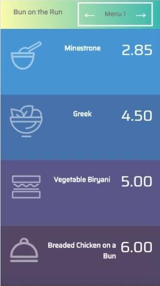

# Assignment 3

## Purpose

This vanilla JavaScript web app displays various daily menus which can be viewed by clicking either the next or previous buttons.  



## Concepts Learned

To create this "Bun on the Run" menu app the following JavaScript concepts were used:
- variables let vs const
- access the DOM elements using document object
- change the inner html of the DOM elements
- passing object as a function argument
- storing data as an object
- using object to update DOM elements
- adding event listener to <button> 
- creating functions and calling them
- parse json objects
- call api endpoints and access data

## How I made the web app

1. First I defined a const called menus and assigned it to be an empty array
    ```js
    const menus = []
    ```
    The reason why I did that is because the menus array will eventually be assigned an array of objects where each object represents a daily menu, complete with menu items and prices.

1. Next I declared a variable currentIndex and initialised its value with 0.
    ```js
    let currentIndex = 0;
    ```
    The reason why I did that is because this variable will be used to keep track of current page number.
    

1. Next I defined const variable menuTitle.
    ```js
    const menuTitle = document.querySelector("#menu h2");
    ```
    The reason why I did that is because the innerHTML of this variable will be used to update the menu title.

1. Next I defined a function display() which takes an argument todaysmenu which is an object containing all the data necessary to update the menu.
    ```js
    function display(todaysmenu) {
        menuTitle.textContent = todaysmenu.title;
        soup.title.textContent = todaysmenu.soup;
        soup.price.textContent = todaysmenu.soupPrice;
        ...etc...
    }
    ```
    This function displays the current menu.  For exammple, it displays the menu title by accessing the DOM element of
    menu and changes its text content to the todaysmenu.title.

1. Next I defined a function called getJson which will fetch our menus data in JSON format
    ```js
    async function init() {
        const res = await fetch("api end point url"); //here we have to pass the api endpoint url we are trying to access
        const data = await res.json();
        menu.push(...data);
        display(menu[currentIndex]);
    }
    ```
    First I defined a constant called res which will be assigned the response we get from our api endpoint that we fetched
    data from.
    
    Next I defined a const called data which is assigned the response from api endpoint in form of a json object.

    Next I inserted that entire array of objects into our menus array by spread operator(...) which would pass data
    object as list.  

    Next I called the function display to display our current menu passing in the argument of our first menu in our array

1.  Next I defined a function called prev which takes no parameter but decrements our currentIndex by 1 then calls our display function
    ```js
    function prev() {
        currentIndex = currentIndex === 0 ? menu.length - 1 : currentIndex - 1;
        display(menu[currentIndex]);
    }
    ```
    The reason I'm manipulating the value of currentIndex is to change the index of the menu array so as to pass different
    argument on every click.

1.  In similar fashion, I also created a function called next with similar logic.
    ```js
    function next() {
        currentIndex = currentIndex === menu.length - 1 ? 0 : currentIndex + 1;
        display(menu[currentIndex]);
    }
    ```

1.  Next I added some click event listeners to both next and previous buttons
    ```js
    previousMenu.addEventListener("click", prev);
    nextMenu.addEventListener("click", next);
    ```
    The reason for adding click event handlers is so that clicking button could call the function prev/next in order to
    change the HTML content of the webpage and to emulate the change in menu;

1.  Finally, I called the init() function to provide the webpage initial data on loading the webpage.
    ```js
    init();
    ```

# Reflection
## What is the hardest part of creating this web app?
- Deciding the flow of the data throughout the webpages.

## What remaining JS concepts are still kind of foggy?
- how fetch requests are made to access the api endpoints.

## Deck of cards API (remnant of Assignment 4)
Given the documentation listed here: https://deckofcardsapi.com/ it lists 2 APIs/REST endpoints `Shuffle the Cards` and `Draw a card`.  What would you need to do to draw 1 card?
- 

```js
    const res = await fetch("https://deckofcardsapi.com/api/deck/new/draw/?count=1");
    const data = await res.json();
    // const data contains the info of the card we have drawn.
```

This is the response we get from the deck of cards api
```
    {
    "success": true,
    "cards": [
        {
            "image": "https://deckofcardsapi.com/static/img/KH.png",
            "value": "KING",
            "suit": "HEARTS",
            "code": "KH"
        }
    ],
    "deck_id":"3p40paa87x90",
    "remaining": 51
}
```

